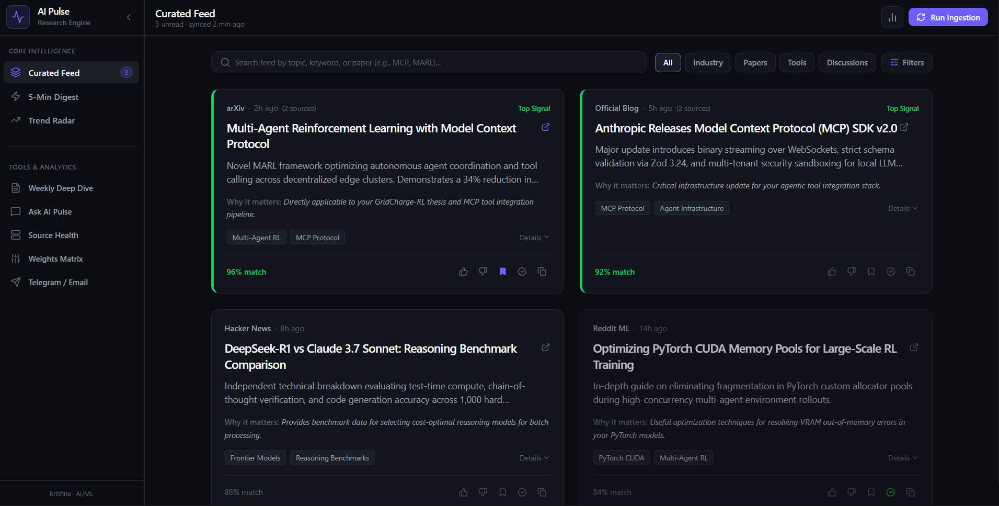

# ⚡ AI Pulse — Personal AI Intelligence Engine

> Autonomous intelligence engine designed to replace 30–60 minutes of fragmented AI news browsing with a high-signal, personalized 5-minute morning briefing.



---

## 🌟 Overview

**AI Pulse** monitors, ingests, deduplicates, and synthesizes breakthroughs across the fast-moving artificial intelligence ecosystem. Tailored specifically for **AI Engineers, RL Researchers, and Systems Architects**, it evaluates incoming signals against your personalized research vector (such as *Multi-Agent Reinforcement Learning / GridCharge-RL*, *Model Context Protocol (MCP)*, and *Agent Tooling*) and delivers actionable **"Why This Matters"** executive takeaways.

---

## ✨ Key Features

### 1. 🎯 Personalized Intelligence Feed
- **Multi-Source Aggregation**: Ingests preprints, announcements, code repositories, and discussions from **arXiv**, **Hacker News**, **OpenAI / Anthropic / DeepMind Research Blogs**, **Reddit ML**, **Product Hunt**, and **YouTube AI Keynotes**.
- **Personalized Relevance Scoring**: Evaluates items on a 0–100% scale based on your active focus profile, keyword weights, and empirical reproducibility indicators.
- **"Why This Matters for Krishna" Analysis**: AI-generated executive reasoning explaining the direct impact on your ongoing research and engineering stack.

### 2. ⏱️ 5-Minute Daily Morning Digest Mode
- Distraction-free, card-by-card executive reading interface designed for your morning routine.
- Clear technical takeaways, source attribution, and progress tracker.
- Built-in completion celebration with time saved metrics and actionable next steps.

### 3. 🧠 Self-Tuning Personalization Weights Matrix
- **Real-Time Learning Loop**: Interactive thumbs-up (+0.06) and thumbs-down (-0.08) actions dynamically recalibrate your focus topic weights.
- **Inspectable Weights Matrix**: Directly view and customize multiplier weights (0.1x to 2.0x) for MARL, MCP Tooling, LLM Evaluation, Agent Memory Systems, and more.
- **Custom Topic Injection**: Add new focus areas with custom trigger keywords and base importance scores.

### 4. 📡 Emerging Signal Radar & Cross-Source Convergence
- Automatically identifies macro industry trends corroborated across 2+ independent sources within a 48-hour window (e.g. an arXiv paper + Hacker News discussion + GitHub repository).
- Visual velocity and signal strength indicators.

### 5. 🤖 Grounded "Ask AI Pulse" Assistant
- Real-time conversational agent grounded exclusively in your ingested intelligence database.
- Provides deep technical answers with direct citations to original papers, benchmarks, and repos.

### 6. 📊 Weekly Executive Deep Dive Synthesis
- High-level weekly intelligence briefings synthesizing dominant architectural shifts, weak signals, and recommended strategic moves for your project roadmap.

### 7. 📲 Dispatch Simulator & Channel Integrations
- **Telegram Bot Dispatcher**: Preview formatted Markdown pushes with interactive bot command triggers (`/digest`, `/marl`, `/top3`).
- **HTML Email Digest**: Responsive, email-client-ready daily summary templates.
- **Source Ingestion Telemetry**: Live status indicators, sync intervals, and one-click manual ingestion triggers.

---

## 🏗️ Architecture & Technology Stack

| Layer | Technology | Description |
| :--- | :--- | :--- |
| **Frontend UI** | React 19 + TypeScript | High-performance reactive interface |
| **Styling & Motion** | Tailwind CSS v4 + Motion (`motion/react`) | Fluid animations, glassmorphism dark aesthetic |
| **Icons & FX** | Lucide React + Canvas-Confetti | Modern UI glyphs & completion celebratory physics |
| **Backend Service** | Node.js + Express (`server.ts`) | Server-side proxy and API orchestration |
| **AI Intelligence** | Google GenAI SDK (`@google/genai`) | Gemini models for scoring, synthesis, and Q&A |
| **Build & Tooling** | Vite 6 + esbuild + tsx | Sub-second dev HMR & optimized production bundles |

---

## 🚀 Setup & Installation Guide

### Prerequisites
- **Node.js** v18.0.0 or higher
- **npm** (or **bun** / **yarn**)
- **Gemini API Key** (available from [Google AI Studio](https://aistudio.google.com/))

---

### Step-by-Step Installation

#### 1. Clone the Repository
```bash
git clone https://github.com/your-username/ai-pulse.git
cd ai-pulse
```

#### 2. Install Dependencies
```bash
npm install
```

#### 3. Configure Environment Variables
Copy the `.env.example` file to `.env`:
```bash
cp .env.example .env
```

Open `.env` and configure your keys:
```env
# Google Gemini API Key for synthesis and Q&A
GEMINI_API_KEY="your_actual_gemini_api_key_here"

# Application URL (optional for local development, defaults to localhost:3000)
APP_URL="http://localhost:3000"
```

#### 4. Launch the Development Server
```bash
npm run dev
```
Open your browser and navigate to:
```
http://localhost:3000
```

---

## 🛠️ Available Scripts

| Command | Description |
| :--- | :--- |
| `npm run dev` | Boots the Express server with Vite middleware via `tsx` on port `3000` |
| `npm run build` | Compiles the React client with Vite and bundles `server.ts` to `dist/server.cjs` |
| `npm start` | Runs the compiled production server (`node dist/server.cjs`) |
| `npm run lint` | Runs the TypeScript compiler (`tsc --noEmit`) to ensure type safety |
| `npm run clean` | Cleans up the `dist` build directory |

---

## 🔌 API Endpoints Reference

The backend Express service exposes the following REST endpoints:

### Ingestion & Feed
- `GET /api/feed` — Retrieves the latest curated intelligence feed items with personalized relevance scores.
- `POST /api/feed/fetch-live` — Triggers an asynchronous ingestion run across all connected sources (arXiv, Hacker News, Reddit, OpenAI, Anthropic, DeepMind).

### Personalization & Feedback
- `GET /api/weights` — Returns the current user profile, topic weights matrix, and learning history.
- `POST /api/weights` — Updates topic weights or registers a new focus topic.
- `POST /api/feedback` — Submits upvote/downvote signals to adjust personalization weights dynamically.

### Conversational Q&A
- `POST /api/ask` — Answers queries grounded strictly in the ingested feed dataset with source citations.

### Dispatch Simulation
- `POST /api/simulate-dispatch` — Generates formatted payloads for Telegram Bot or HTML Email channels.

### System Health
- `GET /api/health` — Returns system uptime, active sources status, and ingestion metrics.

---

## 📐 Personalization Engine Math

Each feed item is evaluated using a composite scoring function:

$$S_{\text{total}} = \min\left(100, \left(S_{\text{base}} \times W_{\text{topic}}\right) + B_{\text{keywords}} + B_{\text{empirical}} + B_{\text{convergence}}\right)$$

Where:
- $S_{\text{base}}$: Base novelty score assigned during ingestion (0–100).
- $W_{\text{topic}}$: User multiplier weight for the primary matching topic ($0.1 \le W \le 2.0$).
- $B_{\text{keywords}}$: Boost for secondary user trigger keywords match ($+4$ per keyword match).
- $B_{\text{empirical}}$: Boost for open-source code repositories, benchmarks, or datasets ($+5$).
- $B_{\text{convergence}}$: Boost when corroborated across multiple independent sources ($+10$).

---

## 📄 License

MIT License © 2026 AI Pulse Project.
